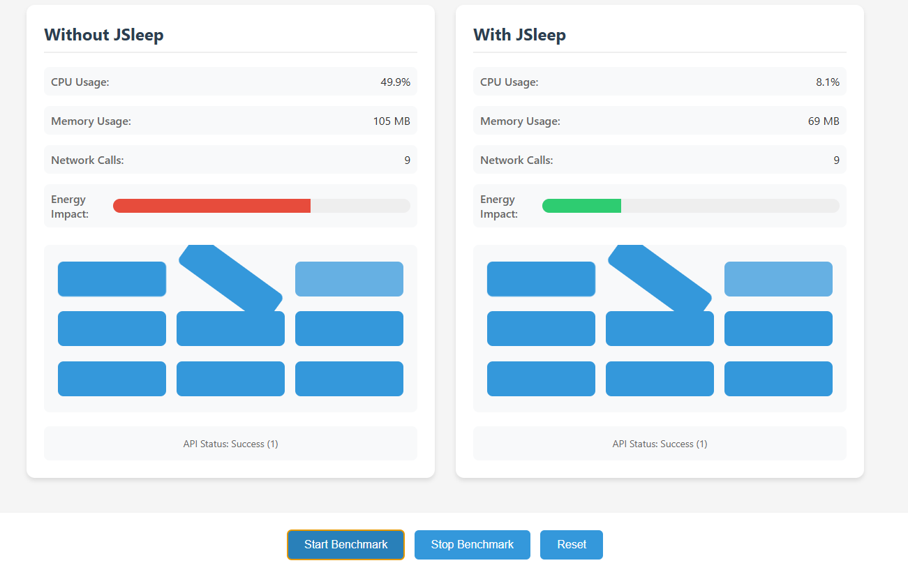

# JSleep

A TypeScript library to optimize energy consumption of web applications by reducing resource usage when the user is idle or the tab is inactive.

## Features

- Reduces animations and transitions when idle
- Throttles network requests when the tab is inactive
- Reduces FPS (Frames Per Second) when idle
- Configurable idle timeout
- Callback hooks for idle and active states
- Automatic cleanup on destroy

## Benchmark



## Installation

```bash
npm install jsleep
```

## Usage

```typescript
import JSleep from 'jsleep';

// Initialize with default configuration
const jsleep = new JSleep();

// Or with custom configuration
const jsleep = new JSleep({
	idleTimeout: 60000, // 1 minute
	reduceAnimations: true,
	stopNetworkCalls: true,
	reduceFPS: true,
	onIdle: () => {
		console.log('User is idle');
	},
	onActive: () => {
		console.log('User is active');
	},
});

// Clean up when you're done
jsleep.destroy();
```

## Configuration Options

| Option           | Type       | Default   | Description                                           |
| ---------------- | ---------- | --------- | ----------------------------------------------------- |
| idleTimeout      | number     | 30000     | Time in milliseconds before considering the user idle |
| reduceAnimations | boolean    | true      | Whether to reduce animations when idle                |
| stopNetworkCalls | boolean    | true      | Whether to stop network calls when idle               |
| reduceFPS        | boolean    | true      | Whether to reduce FPS when idle                       |
| onIdle           | () => void | undefined | Callback when user becomes idle                       |
| onActive         | () => void | undefined | Callback when user becomes active                     |

## How it Works

JSleep monitors user activity and tab visibility to optimize resource usage:

1. **Idle Detection**: Monitors user interactions (mouse, keyboard, scroll, touch) and considers the user idle after the configured timeout.
2. **Tab Visibility**: Automatically optimizes when the tab is not visible.
3. **Resource Optimization**:
   - Pauses CSS animations and transitions
   - Throttles requestAnimationFrame to reduce FPS
   - Queues network requests when the tab is inactive
   - Executes queued requests when the tab becomes active

## License

MIT
